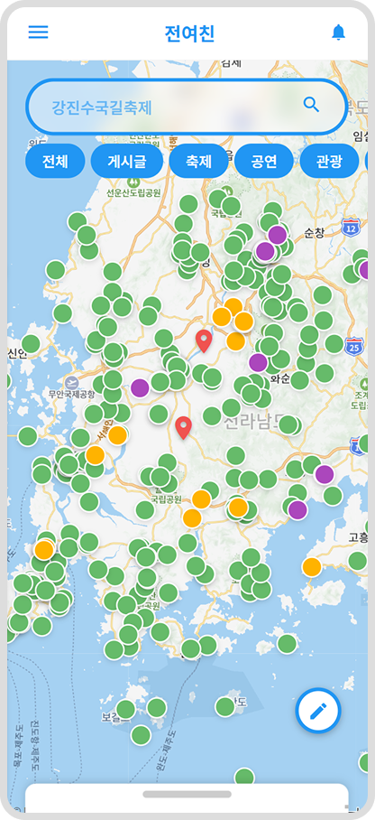
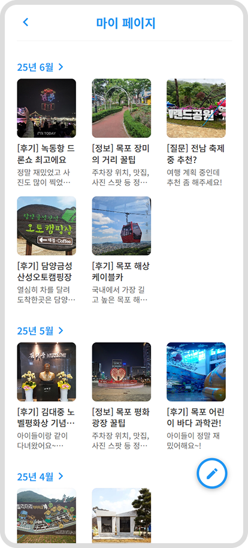

# SMHRD_001
1. 프로젝트명
전남여행친구

2. 서비스소개
지도형 여행 커뮤니티 서비스

3. 프로젝트기간
2025.05.01 - 06.20 (8주)

4. 주요기능
기능1. 지도 기반 핀 등록 기능
- 전라남도 내 관광지, 축제, 문화 행사 등 주요 지점 핀 등록 기능
- 사용자 커뮤니티 게시글 핀 등록 기능

기능2. 사용자 중심 커뮤니티 구성
- 사용자 후기 작성 / 후기별 댓글, 공감 기능 구현

기능3. 카테고리 필터 기능
- 사용자가 관광지 / 축제 / 문화행사 등 카테고리 중 관심 분야만 선택해 지도에 표시

5. 기술스택

6. 시스템 아키텍처

7. 유스케이스

8. 서비스 흐름도

9. ER 다이어그램

10. 화면구성

11. 팀원역할
| 이름   | 구분  | 역할                             |
|--------|-------|----------------------------------|
| 김수진 | 팀장  | Open API 활용, 산출 문서 작성     |
| 박산해 | 팀원  | Back-End, DB 설계 및 구축, 산출 문서 작성 |
| 류현석 | 팀원  | Front-End, 산출 문서 작성         |
| 김태완 | 팀원  | Full-Stack, 지도 API 활용          |
| 심재윤 | 팀원  | DB, 산출 문서 작성                |

12. 트러블슈팅

지도에 마커를 표현하는 과정 속에 마커 표츌이 안되는 점 확인 >> 

NULL 값에 PROPERTY 접근 한 것 확인 후 수정 + 정의 하지 않은 변수 사용 확인 후 수정

  ·  문제 : API 호출 후 DOM 업데이트 시점이 꼬여 빈 화면/에러 발생
  ·  해결 : async/await와 try-catch를 활용하고 로딩 스피너 UI를 추가

  ·  문제 : 지도 API를 불러올 때 비동기 로딩 타이밍 때문에 마커/커스텀 오버레이가 정상적으로 표시되지 않음
  ·  해결 : API 스크립트 로딩 후 window.onload 또는 DOMContentLoaded 이벤트에서 초기화 코드를 실행하도록 수정 → 안정적으로 지도와 핀 표시됨

  ·  문제 : 프론트엔드에서 Open API(축제 정보, 행사 데이터 등)를 호출할 때 CORS 오류 발생
  ·  해결 : 프록시 서버(백엔드)에서 API 호출을 중계하는 방식으로 수정 → 브라우저 요청 정상화
